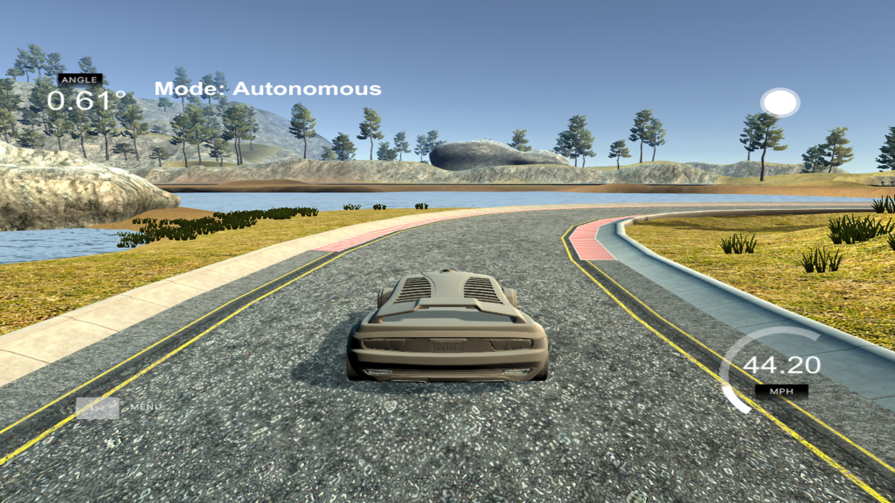

# PID Control

In this project of the Udacity [Self-Driving Car NanoDegree](https://www.udacity.com/course/self-driving-car-engineer-nanodegree--nd013) program, a proportional–integral–derivative (PID) controller is implemented. It feeds [Udacity's car simulator]((https://github.com/udacity/self-driving-car-sim/releases/tag/T3_v1.2)) with steering and throttle control values based on a vehicle's cross-track error, allowing it to navigate safely around a virtual track.

## Resources
* [Self-Driving Car NanoDegree](https://www.udacity.com/course/self-driving-car-engineer-nanodegree--nd013) course description at Udacity
* [PID Control Project Starter Code](https://github.com/udacity/CarND-PID-Control-Project) on GitHub

  

## Prerequisites
You can find detailed instructions for setting up your system on the starter code [project page](https://github.com/udacity/CarND-PID-Control-Project). It involves installing a Unity-based [simulator tool](https://github.com/udacity/self-driving-car-sim/releases/tag/T3_v1.2) and a C++ WebSocket server library [uWebSockets](https://github.com/uWebSockets/uWebSockets).

## Building and Running the Code
1. Clone this repository.
2. Make a build directory: `mkdir build && cd build`
3. Compile: `cmake .. && make`
4. Execute: `./pid`

## Structure
The original starter code was modified and extended to complete the project assignment:
* [driver.h](src/driver.h) / [driver.cpp](src/driver.cpp): WebSocket server and messaging logic modularized and moved from `main.cpp`.
* [PID.h](src/PID.h): PID controller logic.
* [optimizer.h](src/optimizer.h): Function minimizer based on "Twiddle" algorithm.
* [main.cpp](src/main.cpp): Example initialization and usage of the `Driver` and `Optimizer`.

## Implementation Details

Most of the original project starter code was refactored, so that it can be executed in the context of a [function minimizer](src/optimizer.h). The communication logic was moved to the [driver class](src/driver.h), where the cross track error information from the simulator is processed and passed to two [PID controller](src/PID.h) instances, one for calculating the steering control value and another one for throttle control.

The function minimizer treats the controller coefficients as function arguments, which are modified from one function evaluation to another, in order to find the optimal configuration.
Each function evaluation will use a specific set of coefficients to initialize the two PID controllers and then execute [Driver::Run()](src/driver.cpp): This function starts the WebSocket server and enables communication with the simulator for a defined number of message exchanges. The simulator state is reset at the beginning of each new cycle, using a dedicated JSON 'reset' message.

For each exchange, the squared cross track error divided by the vehicle speed is accumulated, effectively forming the cost function for the function minimizer.

### PID Tuning

Both steering and throttle control are calculated from the 'total error' of their respective [PID controller](src/PID.h), each of which are composed of a proportional, an integral and a derivative component. Each component is weighted and scaled by a dedicated coefficient: **Kp**, **Ki** and **Kd**.

   
  <em>Behavior of different PID components, cross track error vs. iteration (courtesy of Udacity)</em>

To get a better feel of each coefficient's influence, I determined a first coefficient configuration by hand, observing the simulator behavior in a trial-and-error fashion.

Keeping throttle at a fixed value of '0.4', I first incremented the proportional coefficient **Kp** of the steering controller, which lead to an oscillating vehicle motion around the lane center: The steering would linearly adjust to the cross track error, but was very prone to overshooting. By increasing the derivative coefficient **Kd** this effect was counteracted and initial oscillation would eventually attenuate (too high values of **Kd** can lead to overshooting as well).
The integrating coefficient **Ki** appears to have little to no effect, most likely because the simulator does not exhibit any bias on vehicle controls.

Increasing the vehicle speed turned out to be more challenging than I had expected. At speeds starting from 35 mph, the vehicle tends to start oscillating fairly quickly and excessively, even on straight sections of the track. The technically induced delay between observing the cross track error and communicating back an adjusted control value, severely limits the PID controller's ability to keep the car on a steady trajectory at higher speeds. 

Turning towards throttle control, I proceeded in a similar way: I replaced the hard-coded control value by a response function, which is linear to a PID controller error. I adjusted **Kp** and **Kd** manually, so that the car would travel at higher speeds (between 30 and 45 mph) but still remain within its lane without too much oscillating. In addition, I added some hard-coded rules to react to extreme steering angles and speeds, see [`Driver::GetThrottleValue`](src/driver.cpp).

I then left the fine-tuning to the [function minimizer](src/optimizer.h). Following the lecture's 'Twiddle' algorithm, the coefficients are adjusted one at a time. For each new configuration, the simulator is reset and the accumulated cross track error after about 1000 iterations (roughly corresponding to one complete lap) is evaluated.

The optimized coefficient values for my implementation, as demonstrated in [this video](readme/recording.mkv), are:
<table>
    <thead>
        <tr>
            <th colspan="3">Steering</th>
            <th colspan="3">Throttle</th>
        </tr>
        <tr>
            <td>Kp</td>
            <td>Ki</td>
            <td>Kd</td>
            <td>Kp</td>
            <td>Ki</td>
            <td>Kd</td>
        </tr>
    </thead>
    <tbody>
        <tr>
            <td>0.17</td>
            <td>0.0001</td>
            <td>1.8</td>
            <td>2.5</td>
            <td>0.0001</td>
            <td>4.0</td>
        </tr>
    </tbody>
</table>

Following the behavior of the optimizer and the evaluated objective function, I realized that the accumulated cross track error bears a certain degree of randomness - probably due to the varying delays in WebSocket communication between simulator and server. This effect should be kept in mind when considering the use of other more sophisticated function optimizers, especially those expecting a numerically stable objective function for gradient estimation.

For more details on the implementation, please refer to the in-code documentation. The [main.cpp](src/main.cpp) file provides a decent starting point.

## License
The contents of this repository are covered under the [MIT License](LICENSE).

